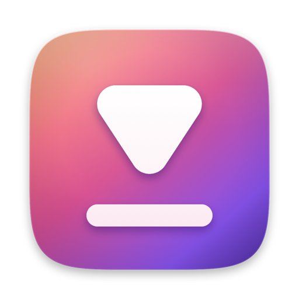
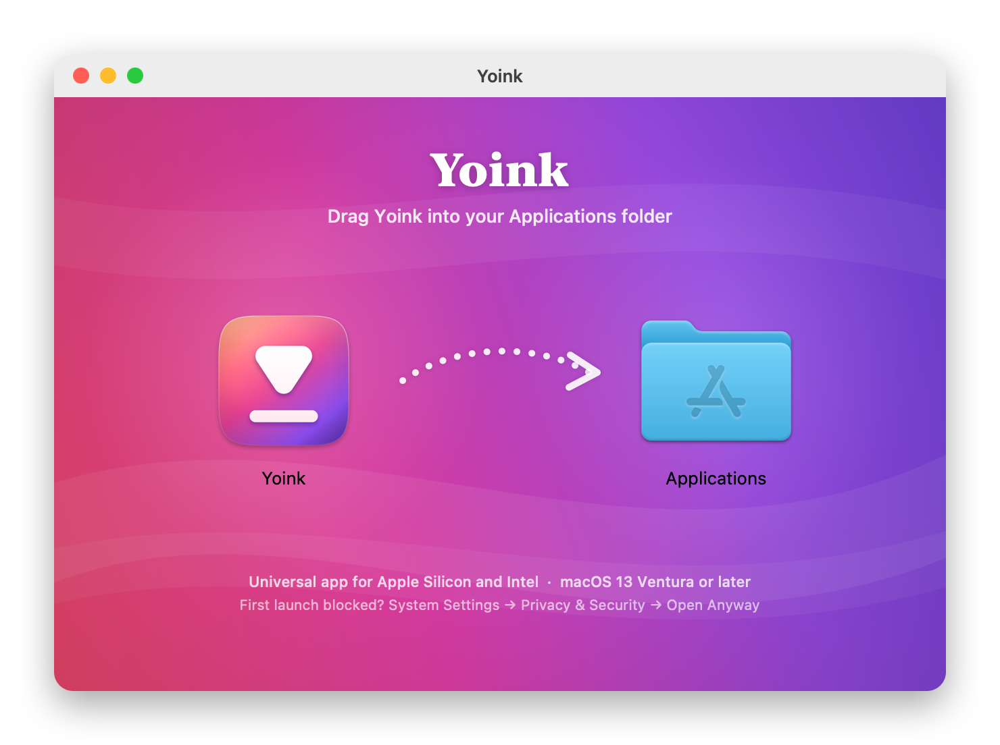

<div align="center">



# Yoink

**Download video and audio from 1000+ sites — natively on your Mac.**<br>
No Terminal. No Homebrew. No nonsense.

[](https://github.com/0x1p0/yoink/releases/latest)

[](#compatibility)
[](#compatibility)
[](https://developer.apple.com/xcode/swiftui/)
[](#license)

[**Download**](https://github.com/0x1p0/yoink/releases/latest) · [Report a Bug](https://github.com/0x1p0/yoink/issues) · [Request a Feature](https://github.com/0x1p0/yoink/issues)

</div>

---

## Demo

https://github.com/user-attachments/assets/d543bf3e-5aa3-4ba5-b808-5bb7b1bcb1f1

---

## What is Yoink?

Yoink is a native macOS app for downloading video and audio from YouTube, Twitch, Instagram, TikTok, X, Reddit, Vimeo, SoundCloud and 1000+ other sites. It wraps [`yt-dlp`](https://github.com/yt-dlp/yt-dlp) and [`ffmpeg`](https://ffmpeg.org) in a clean SwiftUI interface — paste a link, pick Video or Audio, done.

Everything it needs ships inside the app. Nothing to install, nothing to configure.

---

## Install

<div align="center">

</div>

1. **[Download the latest `Yoink-x.y.z.dmg`](https://github.com/0x1p0/yoink/releases/latest)**
2. Open it and **drag Yoink into Applications**
3. Open Yoink from Applications or Launchpad

One download works on every supported Mac — Apple Silicon and Intel.

### First launch

Yoink isn't notarized by Apple yet, so macOS asks you to confirm the first time you open it. This only happens once.

| Your macOS | What to do |
|---|---|
| **15 Sequoia, 26 Tahoe** | Open Yoink → click **Done** on the warning → **System Settings → Privacy & Security** → scroll down → **Open Anyway** → confirm |
| **13 Ventura, 14 Sonoma** | In Applications, **right-click Yoink → Open → Open** |

<details>
<summary>Still says “damaged” or won't open?</summary>

Clear the download quarantine flag in Terminal, then open Yoink again:

```bash
xattr -cr /Applications/Yoink.app
```
</details>

---

## Compatibility

| | |
|---|---|
| **macOS** | 13 Ventura, 14 Sonoma, 15 Sequoia, 26 Tahoe |
| **Processors** | Apple Silicon (every M-series Mac) and Intel — one universal app runs natively on both, no Rosetta |
| **Bundled tools** | `yt-dlp` (universal, macOS 11+), `ffmpeg` + `ffprobe` (universal, macOS 12+) |
| **Runtime dependencies** | None — no Homebrew, Python or Xcode tools needed |
| **Installer** | LZMA-compressed DMG (opens on macOS 10.15+) |

Every release is checked by CI: the build fails if the app or any bundled tool is missing either the Apple Silicon or the Intel slice, or if the app's signature inside the DMG doesn't verify.

---

## Features

### Downloading
- **1000+ sites** — everything yt-dlp supports
- **Video or Audio in one click** — pick exact quality and audio track, or let Yoink choose the best
- **Live progress** — speed, ETA and size on every download; pause, resume, retry
- **Queue** — paste many links at once (or drop a `.txt` of them) and run them in parallel
- **Clips & chapters** — download a time range, or just the chapters you want
- **Subtitles** — pick a language, or download them by default
- **SponsorBlock** — cut sponsors, self-promo and “like & subscribe” reminders automatically
- **Sign-in cookies** — for private, members-only or age-restricted videos

### Everywhere on your Mac
- **Menu bar** — paste a link and go without opening the window; live progress in the icon
- **Clipboard** — copy a video link anywhere and Yoink offers to download it (snooze any time)
- **Watch Later** — save links for later, or schedule a download for a specific time
- **History** — every download, searchable, with Show in Finder and Download Again
- **Duplicate check** — Yoink tells you when you've already downloaded something

### Playlists & channels
- Load a whole playlist or channel, tick the videos you want, and set quality, clips and SponsorBlock per video

### Made for macOS
- **Liquid Glass** interface on macOS 26 Tahoe, with a draggable glass tab bar
- **Light, Dark or System** appearance
- **System Settings–style Settings** — defaults, per-site formats, file naming, save categories, proxy, speed limits, CPU priority and more
- **Keyboard first** — ⌘V paste, ⌘N new link, ⇧⌘D download all, ⌘1–⌘4 switch tabs
- **Stays current** — yt-dlp updates itself quietly so sites keep working; Yoink tells you when a new version is out

---

## Building Locally

### Prerequisites
- Xcode 26 or later (needed for the Liquid Glass APIs; the app itself still runs on macOS 13+)

### Steps

```bash
git clone https://github.com/0x1p0/yoink.git
cd yoink
./download_binaries.sh      # fetches universal yt-dlp, ffmpeg and ffprobe into Yoink/Resources/bin/
open Yoink.xcodeproj
```

Then press **⌘R**. For your own builds, pick your team under the **Yoink** target → **Signing & Capabilities** (or leave it unsigned for local runs).

> Yoink runs without the App Sandbox on purpose — a sandboxed app can't launch `yt-dlp` and `ffmpeg` as helper processes.

### Build a universal release + installer

```bash
# 1. Universal (Apple Silicon + Intel) Release build
xcodebuild -project Yoink.xcodeproj -scheme Yoink -configuration Release \
  -destination 'generic/platform=macOS' -derivedDataPath build \
  ARCHS="arm64 x86_64" ONLY_ACTIVE_ARCH=NO \
  MARKETING_VERSION=1.0.0 CODE_SIGN_IDENTITY="-" CODE_SIGNING_REQUIRED=NO build

# 2. Ad-hoc sign
codesign --force --deep --sign - --entitlements Yoink/Yoink.entitlements \
  build/Build/Products/Release/Yoink.app

# 3. Styled DMG (background, layout, volume icon, LZMA)
packaging/dmg/make_dmg.sh build/Build/Products/Release/Yoink.app Yoink-1.0.0.dmg "Yoink 1.0.0"
```

`make_dmg.sh` installs [`dmgbuild`](https://github.com/dmgbuild/dmgbuild) into a throwaway virtualenv, so it never touches your system Python.

### Releases

Every push to `main` runs [`.github/workflows/release.yml`](.github/workflows/release.yml), which fetches the binaries, builds the universal app, verifies it, packages the styled DMG, verifies the DMG, and publishes a GitHub release tagged `v1.0.<run number>`.

<details>
<summary>Notarizing (optional — removes the first-launch warning)</summary>

Requires a paid Apple Developer account. Sign with a Developer ID certificate and hardened runtime instead of ad-hoc, then:

```bash
xcrun notarytool submit Yoink-1.0.0.dmg --apple-id you@example.com \
  --team-id YOUR_TEAM_ID --password APP_SPECIFIC_PASSWORD --wait
xcrun stapler staple Yoink-1.0.0.dmg
```
</details>

### Artwork

The icon and installer artwork are drawn in code, so they're easy to tweak and rebuild:

```bash
packaging/icon/build_icons.sh   # app icon (all sizes), DMG volume icon, README logo
packaging/dmg/build_assets.sh   # installer background (1x + 2x) and README preview
```

---

## Project Structure

```
yoink/
├── download_binaries.sh                 # fetch universal yt-dlp / ffmpeg / ffprobe
├── packaging/
│   ├── icon/                            # app icon source + generator
│   └── dmg/                             # installer background, layout (dmgbuild) and scripts
├── .github/workflows/release.yml        # build → verify → package → publish
└── Yoink/
    ├── Sources/
    │   ├── YoinkApp.swift               # app entry, windows, menu bar, notifications
    │   ├── Models/                      # DownloadJob, SettingsManager, ThemeManager, Haptics
    │   ├── Services/
    │   │   ├── DependencyService.swift  # installs, checks and updates the bundled tools
    │   │   ├── DownloadService.swift    # metadata, downloads, progress parsing
    │   │   ├── DownloadQueue.swift      # the queue and save folder
    │   │   ├── ClipboardMonitor.swift   # clipboard link detection and snooze
    │   │   ├── HistoryStore.swift, WatchLaterStore.swift, ScheduledDownloadStore.swift
    │   │   ├── TwitchService.swift      # fast Twitch VOD / clip metadata
    │   │   └── AppUpdateService.swift, MediaTools.swift, PostDownloadActions.swift, ThumbnailCache.swift
    │   └── Views/
    │       ├── ContentView.swift        # main window, glass tab bar, toolbar
    │       ├── JobCard.swift            # a download card and its options
    │       ├── MenuBarView.swift        # menu bar popover
    │       ├── SettingsView.swift       # System Settings–style preferences
    │       ├── AdvancedView.swift       # playlists & channels
    │       ├── WatchLaterView.swift, HistoryView.swift, TutorialView.swift, Sheets.swift
    │       └── YoinkUI.swift            # shared controls (chips, menus, status)
    └── Resources/
        ├── Assets.xcassets/             # app icon, accent colour
        └── bin/                         # yt-dlp_macos/, ffmpeg, ffprobe (from download_binaries.sh)
```

---

## How the Bundled Tools Work

On first launch Yoink copies its tools from the app bundle to `~/Library/Application Support/Yoink/bin/`, a writable location where `yt-dlp` can update without touching the app.

```
App launches
  └─ Install bundled tools (first run, or when an older layout is found)
       Resources/bin/ → ~/Library/Application Support/Yoink/bin/
  └─ Check versions → Settings → Advanced
       If automatic updates are on and it's been 24 h:
         └─ Newer yt-dlp on GitHub? Download yt-dlp_macos.zip → verify it runs → swap it in
```

Yoink uses yt-dlp's **unpacked** macOS build rather than the single-file one. The single file re-extracts itself on every run (about 7 s per call); the unpacked build starts in about 0.2 s, which makes fetching video details several times faster.

---

## Acknowledgements

- [yt-dlp](https://github.com/yt-dlp/yt-dlp) — the engine behind every download
- [FFmpeg](https://ffmpeg.org) — merging, cutting and converting (builds by [martin-riedl.de](https://ffmpeg.martin-riedl.de))
- [SponsorBlock](https://sponsor.ajay.app) — community-sourced sponsor segments
- [dmgbuild](https://github.com/dmgbuild/dmgbuild) — the styled installer

---

## License

MIT
